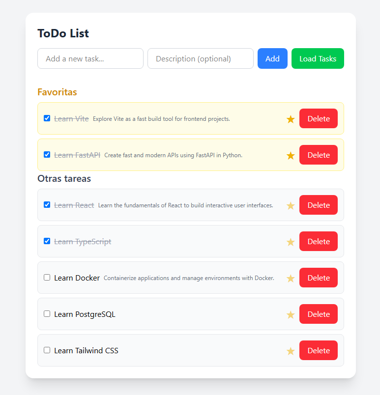

# Technical Test: Todo App (FastAPI + Vite)

This is a Todo list application developed as a technical test, with a FastAPI (Python) backend and a React + Vite + TypeScript frontend. It allows you to create, complete, delete, describe, and mark tasks as favorites, displaying favorites in a highlighted section.

---

## Technologies Used
- **Backend:** FastAPI (Python)
- **Frontend:** React, Vite, TypeScript, TailwindCSS

---
## Final Screenshot



## Installation and Running

### 1. Clone the repository and enter the project folder

```bash
# Clone the repository
git clone https://github.com/MartinM10/TechnicalTest.git
cd technical-test
```

### 2. Backend (FastAPI)

```bash
cd backend
python -m venv .venv
source .venv/bin/activate  # On Windows: .venv\Scripts\activate
pip install -r requirements.txt
uvicorn app.main:app --reload
```

### 3. Frontend (React + Vite)

```bash
cd frontend
npm install
npm run dev
```

Open your browser at [http://localhost:5173](http://localhost:5173)

---

## Main Features
- Add tasks with title and description.
- Mark tasks as completed.
- Delete tasks.
- Mark/unmark tasks as favorites (star).
- View favorite tasks in a separate, highlighted section.
- The list auto-reloads when adding, deleting, or updating tasks.

---

## How Each Task Was Solved

### 1. Task Completion Status Functionality
To allow marking tasks as completed and saving this status in the backend, the following was implemented:
- **Backend:**
  - The `Todo` model (`BaseModel` in `schemas.py`) was modified to include an `id` field, so each task can be uniquely identified and updated.
  - The endpoint: `PATCH /todos/{todo_id}` in `routers.py` (`update_todo` function) was added to update the `completed` status (and other fields) of a task by its `id`.
  - Existing tasks in `todos.json` were updated to include an `id` for each task.
- **Frontend:**
  - Function: `toggleTodoStatus` in `src/api/todo.ts` sends a PATCH request to update the `completed` field.
  - The checkbox in the UI calls this function, and the UI reloads the list after updating.
- **Why:** This ensures the completed status is persistent and reflected in both backend and frontend.

### 2. Delete Task Functionality
To allow users to delete tasks:
- **Backend:**
  - Endpoint: `DELETE /todos/{todo_id}` in `routers.py` (`delete_todo` function). This removes the task by its `id` from the data store.
- **Frontend:**
  - Function: `deleteTodo` in `src/api/todo.ts` sends a DELETE request.
  - The "Delete" button in the UI calls this function, and the list reloads after deletion.
- **Why:** This provides a simple and direct way for users to remove tasks, keeping the list up to date.

### 3. Auto-load Tasks
To ensure the UI always shows the latest data:
- **Frontend:**
  - Function: `getTodos` in `src/api/todo.ts` fetches the current list from the backend.
  - The `loadTodos` function in `App.tsx` is called on page load (via `useEffect`) and after adding, updating, or deleting a task.
- **Why:** This guarantees the user always sees the current state of their tasks without manual refresh.

### 4. Descriptions and Favorite Tasks Section
To enhance the task model and UI:
- **Backend:**
  - The `Todo` model in `schemas.py` and the endpoints support a `description` and `favorite` field.
  - The `PATCH /todos/{todo_id}` endpoint allows updating both fields.
- **Frontend:**
  - Function: `createTodo` in `src/api/todo.ts` allows sending a description when creating a task.
  - Function: `updateFavoriteStatus` in `src/api/todo.ts` toggles the `favorite` field via PATCH.
  - The UI includes an input for description and a large, clickable star for marking favorites.
  - Favorite tasks are displayed in a separate, yellow-highlighted section at the top of the list.
- **Why:** This makes the app more useful and user-friendly, allowing users to organize and prioritize their tasks.

### 5. README
This README provides clear instructions for installing, running, and using the application, as well as a detailed explanation of how each requirement was addressed and why certain design decisions were made.
